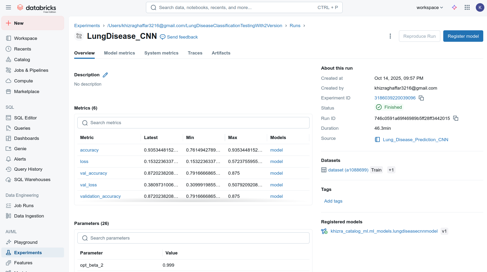
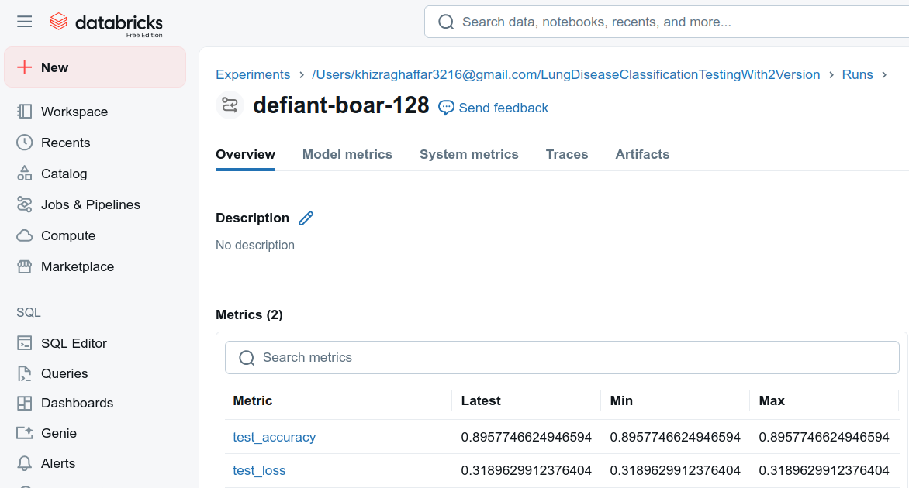
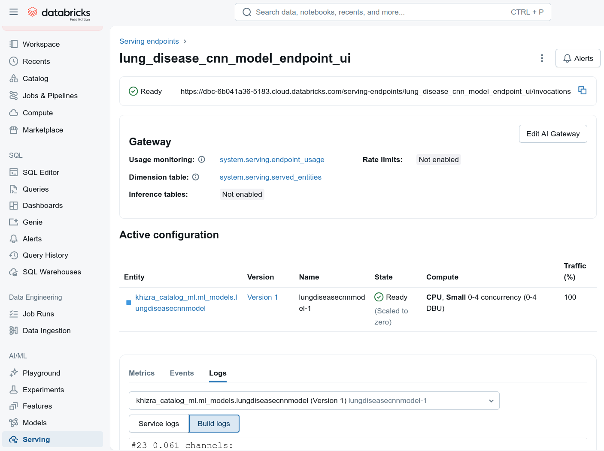

# Lung Disease Classification using CNN and MLflow with Databricks

This project implements a **multi-class lung disease classification model** using Convolutional Neural Networks (CNN) on chest X-ray images. It demonstrates **training, hyperparameter optimization using Hyperopt, MLflow tracking, and deployment with Databricks Model Serving**.

---

## Table of Contents

- [Project Overview](#project-overview)
- [Dataset](#dataset)
- [Setup & Installation](#setup--installation)
- [Training the Model](#training-the-model)
  - [Without Hyperparameter Tuning](#without-hyperparameter-tuning)
  - [With Hyperopt](#with-hyperopt)
- [MLflow Integration](#mlflow-integration)
- [Model Registration in Databricks Unity Catalog](#model-registration-in-databricks-unity-catalog)
- [Model Serving](#model-serving)
  - [Local Serving](#local-serving)
  - [Databricks Model Serving](#databricks-model-serving)
- [Evaluation & Predictions](#evaluation--predictions)
- [Results](#results)
- [References](#references)

---

## Project Structure 
```plaintext
lung_disease_classification/
│
├── Images/
├── notebooks/
│   └── lung_disease_classification1       # Visualization and interactive runs
│   └── lung_disease_classification2       # Visualization and interactive runs (Using Hyperopt Parameters)
│
├── src/
│   ├── __init__.py
│   ├── config.py                            # All constants (paths, image size, etc.)
│   ├── data_preprocessing.py                # Load, split, and preprocess datasets
│   ├── model.py                             # CNN model builder
│   ├── train_basic.py                       # Training without hyperparameter tuning
│   ├── train_hyperopt.py                    # Training with Hyperopt
│   ├── evaluation.py                        # Evaluation and plotting
│   ├── serving.py                           # Model serving (local + Databricks)
│   └── utils.py                             # Visualization, helper utilities
│
├── requirements.txt
└── README.md
```

## Dataset Overview

I used the **Lung X-Ray Image dataset** from Kaggle:   [Kaggle Dataset: Lung Disease](https://www.kaggle.com/datasets/fatemehmehrparvar/lung-disease)

The dataset contains X-ray images organized in folders per class:

```plaintext
Lung X-Ray Image/
├── Lung_Opacity/
├── Normal/
└── Viral Pneumonia/
```

The goal of this project is to classify chest X-ray images into multiple categories:

- **Normal**
- **Lung_Opacity**
- **Viral Pneumonia**


The CNN model is trained on a Kaggle dataset and optimized using **Hyperopt** for best hyperparameters. MLflow from Databricks is used for **experiment tracking, model logging, and versioning**.


## Setup & Installation

Install required packages:

```bash
pip install tensorflow mlflow matplotlib kaggle hyperopt
```
Set up Kaggle API credentials in `kaggle_credentials.py:

```bash
kaggle_json = {
    "username": "<KAGGLE_USERNAME>",
    "key": "<KAGGLE_API_KEY>"
}
```

Download the dataset:
```bash
kaggle datasets download -d fatemehmehrparvar/lung-disease -p /tmp/lung_data --unzip
```

## Training the Model
### Without Hyperparameter Tuning

- Define a CNN model.
- Compile the model with appropriate loss and optimizer.
- Train the model using MLflow for experiment tracking.
```bash
mlflow.set_experiment("/Users/<USER_EMAIL>/LungDiseaseClassification")

with mlflow.start_run(run_name="LungDisease_CNN"):
    mlflow.tensorflow.autolog()
    history = model.fit(
        training_dataset,
        validation_data=validation_dataset,
        epochs=10
    )
```
- Evaluate the model on the test dataset and log metrics.

### With Hyperparameter Tuning (Hyperopt)

- Define the hyperparameter search space.
```bash
from hyperopt import fmin, tpe, hp, Trials

search_space = {
    'conv_filters': hp.choice('conv_filters', [32, 64, 128]),
    'dense_units': hp.choice('dense_units', [64, 128, 256]),
    'learning_rate': hp.uniform('learning_rate', 1e-4, 1e-2),
    'batch_size': hp.choice('batch_size', [16, 32, 64])
}
```

- Run hyperparameter optimization using Hyperopt.
```bash
best_params = fmin(
    fn=objective,
    space=search_space,
    algo=tpe.suggest,
    max_evals=5,
    trials=trials
)
best_params = fmin(fn=objective, space=search_space, algo=tpe.suggest, max_evals=5, trials=Trials())
```

- Train the final model using the best hyperparameters.

- Evaluate the model on the test dataset and log metrics.
```bash
test_loss, test_accuracy = model.evaluate(testing_dataset)
mlflow.log_metric("test_accuracy", test_accuracy)
mlflow.log_metric("test_loss", test_loss)
```
- Databricks MLflow Experiment Screenshot






## Results

| Model           | Accuracy | Loss   | Test Accuracy | Test Loss |
|-----------------|---------|-------|---------------|-----------|
| Before Hyperopt | 0.9177  | 0.2046| 0.8760        | 0.4058    |
| After Hyperopt  | 0.9353  | 0.1532| 0.8958        | 0.3190    |


## Model Registration in Databricks Unity Catalog

1. Create a Custom Catalog and Schema in Databricks
```sql
CREATE SCHEMA IF NOT EXISTS khizra_catalog_ml.ml_models;
SHOW SCHEMAS IN khizra_catalog_ml;
```

2. Register the Model

- Fully qualified model name (e.g.): `khizra_catalog_ml.ml_models.lungdiseasecnnmodel`
- Go to Experiments → Run → Artifacts → model → Register Model


## Model Serving
### Local Serving

1. Start a local REST server
```bash
mlflow models serve -m "/tmp/lung_cnn_model" -p 5000 --no-conda
```

```bash
Send requests
import requests, json

url = "http://127.0.0.1:5000/invocations"
data = json.dumps({"instances": img_array.tolist()})
headers = {"Content-Type": "application/json"}

response = requests.post(url, data=data, headers=headers)
print(response.json())
```


### Databricks Model Serving

1. Enable serving for the registered model in Databricks UI.
2. Choose compute size and start the endpoint.
3. Use the endpoint URL with authorization:
```bash
url = "https://<your-databricks-instance>/serving-endpoints/lung_disease_cnn_model_endpoint_ui/invocations"
headers = {
    "Authorization": "Bearer <YOUR_DATABRICKS_TOKEN>",
    "Content-Type": "application/json"
}
data = json.dumps({"instances": img_array.tolist()})

response = requests.post(url, data=data, headers=headers)
print(response.json())
```

Important: `img_array` must have shape (1, 256, 256, 3) - i.e., real image with batch dimension.




## Reference
[TensorFlow Documentation](https://www.tensorflow.org/learn)

[MLflow Documentation](https://docs.databricks.com/aws/en/mlflow/)

[Databricks Documentation](https://docs.databricks.com/aws/en/)

[Hyperopt Documentation](https://docs.databricks.com/aws/en/machine-learning/automl-hyperparam-tuning/hyperopt-concepts)
